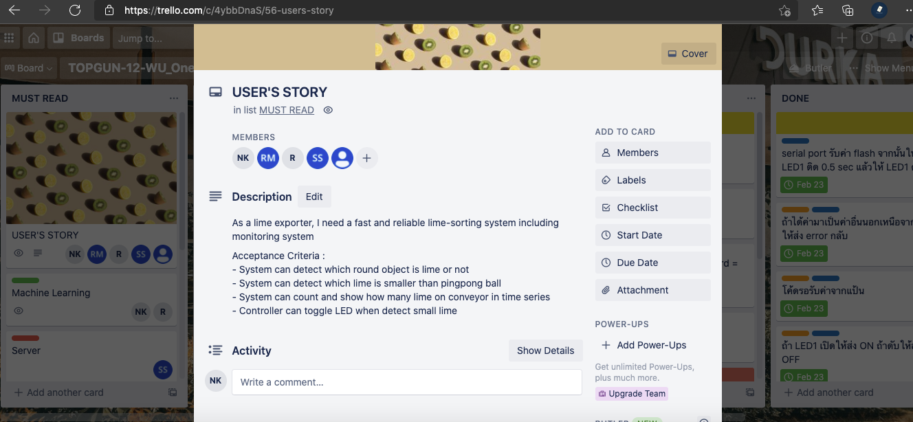
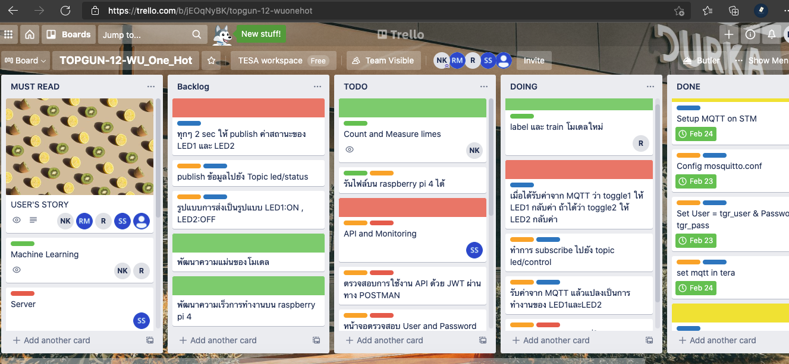
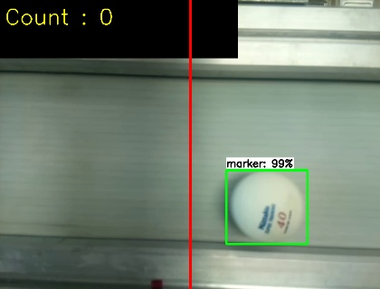
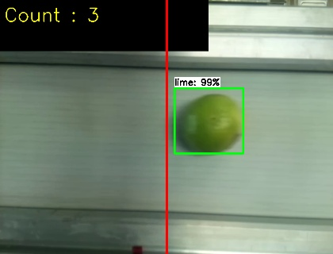
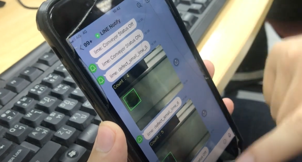

# TESA Top Gun Rally 2021

## Introduction

Repo for Tesa Gun Rally 2021 by Thai Embedded System Association (TESA)
WU-one-hot team #12 (ML only)

Topic: Smart Manufacturing System (Lime classifying and counting system)

TGR2021 is a national competition for embedded systems. The project was organized over a week, with a team of 5 students from each institution to develop in various fields (Hardware, Backend, Machine Learning)


## Project
Hardware: STM32 board, Raspberry Pi 4 <br />
Backend: Laravel <br />
ML: tensorflow, opencv <br />

For project demo video, click [here](https://youtu.be/aTOO-XAYvOc) <br />

We brainstormed to create sprint backlog (a day per sprint). <br />




 
 For the ML part, We prepared and trained lime images to run object detection on Raspberry pi 4. Then, we added some logic to classify and count limes on conveyor. If there is a small-sized lime (compare to marker), raspberryPi will publish action to STM32 board via MQTT and also LINE notify.   


TensorflowLite on Raspberry pi [video](https://youtu.be/5YDpVrRVxgk) <br />
For project demo video, click [here](https://youtu.be/aTOO-XAYvOc)

First, You have to download a test video from this [link](https://drive.google.com/file/d/1F0Vq4bzrvmP4AL4t0rX995Fwayc905aY/view?usp=sharing). <br />
Dependencies are provided in requirements.txt <br />

To run it: <br />

```bash
 python3 TFlite_new.py 
```





To capture : press w
To quit: press q 


